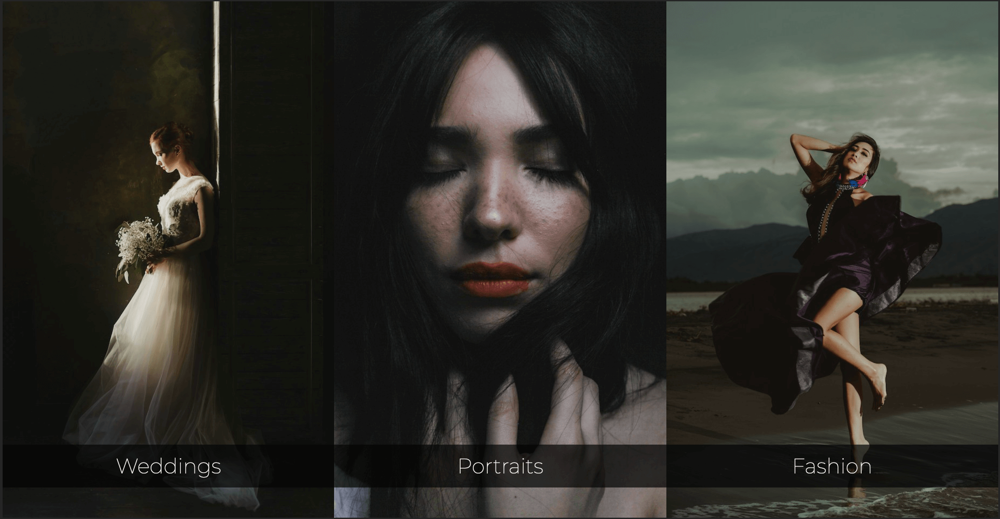
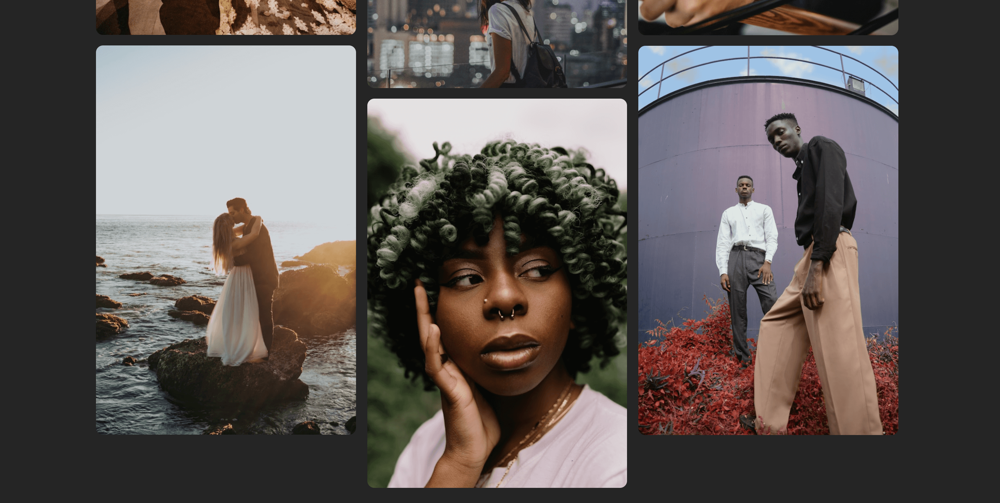
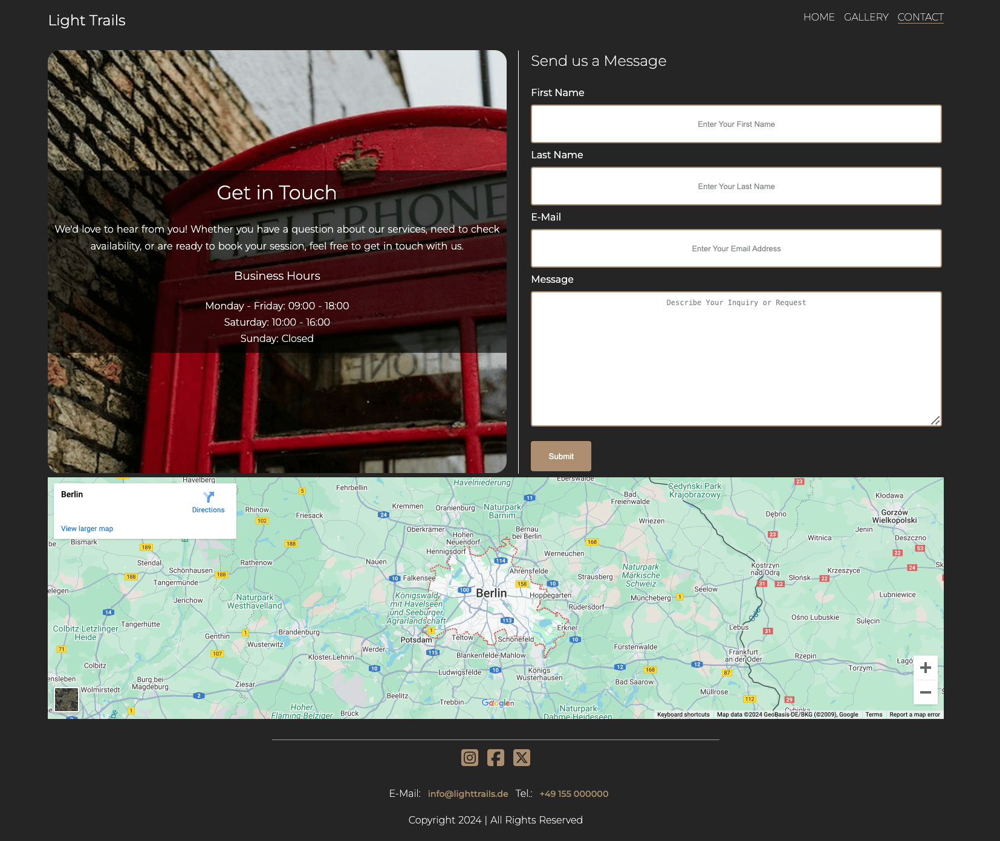

# **Light Trails Photography**

[Click here to go to the Live Project](https://razmikmovsisyan.github.io/light_trails/)

Welcome to Light Trails Photography!

We are dedicated to capturing life’s most meaningful moments with an artful eye and creative approach. 
Specializing in weddings, portraits, and fashion photography, our passion lies in creating images that are not only beautiful but also deeply personal. 
From the romance of weddings to the uniqueness of individual portraits and the vibrancy of everyday life, each photograph is crafted to reflect authentic emotions and stories. 
Let us help you preserve your memories in timeless, evocative images that you will cherish forever.

## **Table of contents**

- [**Light Trails Photography**](#light-trails-photography)
  - [**Table of contents**](#table-of-contents)
  - [**Planning**](#planning)
    - [**Site Owner Goals**](#site-owner-goals)
    - [**User Stories**](#user-stories)
  - [**Features**](#features)
    - [**Used Technologies**](#used-technologies)
    - [**Header and Navigation**](#header-and-navigation)
    - [**Main Photos**](#main-photos)
    - [**Welcome Section**](#welcome-section)
    - [**Footer**](#footer)
    - [**Gallery and Photo Layout**](#gallery-and-photo-layout)
    - [**Contact Page**](#contact-page)
    - [**Accessibility-Focused**](#accessibility-focused)
  - [**Color Scheme**](#color-scheme)
  - [**Fonts**](#fonts)
  - [**Testing**](#testing)
    - [**Manual Testing**](#manual-testing)
    - [**Validation and Issues**](#validation-and-issues)
      - [**HTML**](#html)
          - [**index.html**](#indexhtml)
          - [**contact.html**](#contacthtml)
      - [**CSS**](#css)
    - [**Bugs**](#css)
    - [**Lighthouse**](#lighthouse)
  - [**Deployment**](#deployment)
  - [**Version Control**](#version-control)
  - [**Development Process and Commands**](#development-process-and-commands)
  - [**Future Enhancements**](#future-enhancements)
  - [**Credits**](#credits)

## **Planning**

### **Site Owner Goals**

- As a site owner, I want to ensure a seamless experience for potential clients and photography enthusiasts.
- As a site owner, I want to display my top photos in a well-organized gallery.
- As a site owner, I want to present my photography in a professional and accessible format.
- As a site owner, I want my website to convey a high level of professionalism.
- As a site owner, I want to make it easy for users to reach out and connect with me.

### **User Stories**

- As a user, I want to browse the website effortlessly on any device.
- As a user, I want simple navigation through various photo collections.
- As a user, I want to explore and enjoy unique photography styles.
- As a user, I want a visually engaging and well-structured gallery experience.
- As a user, I want to learn about the photographer’s work.
- As a user, I want access to a contact form for easy communication.

## **Features**

#### **Used Technologies**  

- **HTML:** Hyper Text Markup Language
- **CSS:** Cascading Style Sheets

#### **Header and Navigation**  
The header includes a responsive navigation bar with a text logo on the left, that adapts seamlessly to different screen sizes, providing quick access to each main section of the site.
On the mobile version, the menu is centered with the logo positioned above for a balanced visual design.

The menu elements underlined to indicate the page you're currently on.

**Tablet, Laptop and Desktop Version**

The navigation links feature a consistent `:hover` effect across all devies.
This effect is displayed on all menu items, regardless of whether they are currently selected.

**Mobile Version**

  
  
  

#### **Main Photos**  
The three featured photos have a subtle zoom hover effect, each accompanied by a caption. This section is fully responsive, displaying three columns on tablet, laptop, and desktop screens, and adjusting to a single-column layout on mobile.

**Tablet, Laptop and Desktop Version**

**Mobile Version**

  
  
  

#### **Welcome Section**  
Below the header, a welcoming message introduces visitors to Light Trails Photography, highlighting the services offered in a concise and engaging way.

**Tablet, Laptop, Desktop and Mobile Version**

  
  

#### **Footer**  
The footer features links to social media profiles, site navigation, and additional resources. Designed with simplicity in mind, it offers accessible navigation across all devices, including a call-to-action for visitors to send an email or make a direct call.

**Tablet, Laptop, Desktop and Mobile Version**

  
  

#### **Gallery and Photo Layout**  
The gallery showcases curated collections for weddings, portraits, and lifestyle photography, providing a glimpse into the high-quality work. The gallery displays images in a grid format, adapting to a single-column layout on mobile and a three-column layout on larger screens for optimal viewing.

**Tablet, Laptop, Desktop Version**

**Mobile Version**

  
  
  

#### **Contact Page**
A straightforward contact form invites visitors to reach out easily, enabling them to inquire about services directly for hassle-free communication.
The contact form is designed with accessibility in mind. All input elements, including the textarea, are required fields to ensure complete information before sending a message. The form is fully functional, using a `POST` parameter that directs submissions to the Code Institute submission page.

Below, you will find a fully functional embedded Google Maps iframe, optimized for navigation across all devices.

**Tablet, Laptop, Desktop Version**

**Mobile Version**

  
  
  

#### **Accessibility Focused** 
Main Photos are design with aria label.
Also footer includes aria labelled social media links that open in a new window, as well as email and telephone links for direct communication, along with a contact form to ensure reliable communication with the website owner.

## Color Scheme

Using [colors.co](https://coolors.co/252525-ad8e70-ffffff) for the website, I opted for a modern and compact solution that is visually appealing. 
Dark mode is popular because it reduces eye strain, especially in low-light environments, and saves battery life on OLED screens. It offers a sleek, contemporary aesthetic, making images and content stand out more clearly.

Many users prefer it for comfort, and its popularity in apps like Twitter and YouTube has made it more widely adopted. Additionally, offering dark mode as an option gives users more control over their browsing experience.

For the color scheme, I selected a harmonious and minimalistic blend of black and dark grey, with a mix of black coffee (the background) and white milk (the text color), drawing inspiration from one of the most beloved beverages: coffee/cappuccino.

## Fonts

I chose the Google font Montserrat because of its modern, clean, and versatile design. It offers excellent readability and a professional, yet approachable aesthetic. Its geometric style works well for both headings and body text, giving your site a contemporary feel. Montserrat is also widely supported across devices and browsers, ensuring consistency and accessibility for all users. 
Sans-Serif as the fallback font to ensure that, if Montserrat isn't available, a clean, modern, and easily readable font is used. Sans-serif fonts are also widely supported across devices and browsers, maintaining a legible appearance, even if the primary font fails to load.

## Testing

### Manual Testing  
- I tested the responsive design of the website on Safari, Chrome, Firefox, and Edge using a Windows OS.
- I then shared the website with family members to confirm functionality across different devices and gathered their feedback on user experience.
- I manually tested all internal and external links on the website and made sure that external links open in a new tab.
- I ensured that all contact form fields require valid inputs and confirmed the form submission directs to the Code Institute submission page.
- While building the project I have used Safari Browser on my MacBook and iOS device.

### Validation and Issues

Links to PDF Files of Validated Source Codes of both HTML and CSS.

- [`index.html`](assets/readme/html-css-validator/html-validator-index.pdf)
- [`gallery.html`](assets/readme/html-css-validator/html-validator-gallery.pdf)
- [`contact.html`](assets/readme/html-css-validator/html-validator-contact.pdf)

- [`styles.css`](assets/readme/html-css-validator/css-validator-css.pdf)

### HTML  

Using the input method, I copied and pasted the code of [`index.html`](assets/readme/html-css-validator/html-validator-index.pdf), [`gallery.html`](assets/readme/html-css-validator/html-validator-gallery.pdf), and [`contact.html`](assets/readme/html-css-validator/html-validator-contact.pdf), encountering the following issues, as seen in the screenshots:

#### index.html

**Error:**

**Fix:**

#### contact.html
**Error:**

**Fix:**

After fixing them accordingly, I repeated the process and found no further errors:

#### CSS  

Using the same method I have used **Jigsaw** to validate the [`styles.css`](assets/readme/html-css-validator/css-validator-css.pdf).

## Bugs

Fixed Bugs:

- Path issue with loading the stylesheet and other image sources on the deployed version.
Unfixed Bugs:

Unfixed Bugs:

- There are no unfixed bugs.

#### Lighthouse

  
  

I used the **Chrome Lighthouse** tool and received optimal scores for performance, accessibility, best practices, and SEO on the homepage. 

Using the same approach, I have built the other pages of my project. 

It's important to note that Lighthouse results can vary due to factors such as network conditions, device performance, and testing environment. However, it remains a valuable tool for assessing website performance and identifying areas for improvement.

## **Deployment**

I followed Code Institue's Love Running Tutorial tip and deployed my website early. The steps to deploying a website on GitHub pages are:

1. Open the [repository](https://github.com/RazmikMovsisyan/light_trails) and go to the **Settings** tab.
2. Navigate to the **Pages** tab in the left menu.
3. Choose **Deploy from a branch** and select the according branch, *main* in my case.
4. Click save. The link to the deployed website can then be found in the [repository](https://github.com/RazmikMovsisyan/light_trails) on the right menu under **Environments**.

The link to my live site is: [Light Trails](https://razmikmovsisyan.github.io/light_trails/)

## Version Control
* The sourse of code is stored in the [GitHub](https://github.com/) page.
* The repository contains a single branch, and all code has been submitted and commited as it was written, to ensure a good understanding. The repository can be found at this [Link](https://github.com/RazmikMovsisyan/light_trails), and can be downloaded or cloned for further development.

## Development Process and Commands

- I started the program and repository by using the [gitpod template](https://github.com/Code-Institute-Org/gitpod-full-template) provided by the Code Insitute.  
- Then I regularly staged my changes using the command `git add <filename>` or `git add .` and then committed the staged changes to my local repository using `git commit -m 'short descriptive message here'`. 
- Finally, I would push the commits from my local repository up to the Github repository using the command `git push`.
- With every push, Github automatically deploys my latest commit from the 'main' branch to the Github pages.

   
## Future Enhancements

This website has all the essential features to make it a functional minimum viable product, ready for real-world use. However, there is still a lot of potential for further enhancements and additional features. Here are a few ideas:

- Implement a lightbox feature for fullscreen photo viewing.
- Add a blog section for photo stories and travel experiences.
- Create a dynamic gallery with filtering options by location or theme.
- Implementing additional accessibility improvements, such as keyboard navigation and optimized screen reader support.
- Add the following pages and functions: Terms and Conditions, Imprint, Privacy Policy, Cookies, Error 404 Page and a search function.

## Credits

I would like to thank my mentor, Marcel, for his tips and support throughout this project. I’m also grateful to the Code Institute support team, especially [Kristyna Wach](https://github.com/Cushione), for providing the weekly guidance I needed to stay on track.

A special thank to my Golden Retriever, Alice, for her patience and support for allowing me spending the time with coding instead of playing with her.

- [Am I Responsive](https://ui.dev/amiresponsive)
Used to create a mockup for testing website responsiveness on various devices.
- [Google Fonts](https://fonts.google.com/)
Used for the Montserrat font on the site.
- [Google Maps](https://maps.google.com/)
Embedded map for location display and navigation.
- [Unsplash](https://unsplash.com/) Free images used on the site.
- [Font Awesome](https://fontawesome.com/) Social Media Icons on Footer.
- [Icons8](https://icons8.com/) Favicon.

